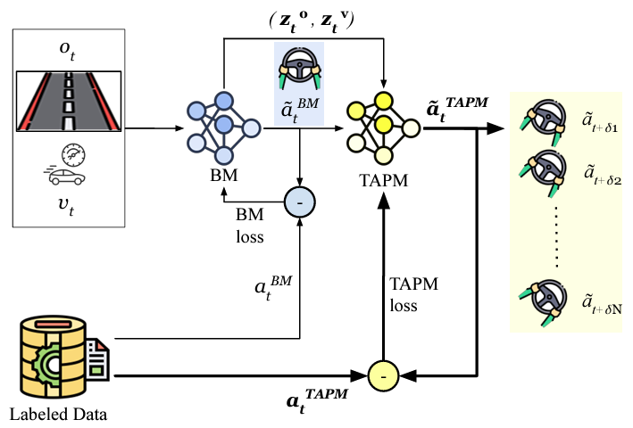

# PLM-Net: Perception Latency Mitigation Network for Vision-based Lateral Control of Autonomous Vehicles


## Paper

You can find the full paper [here](https://arxiv.org/abs/2407.16740).

## Cite this work

If you find our work useful in your research, please consider citing us:

@article{khalil2024plm,
  title={PLM-Net: Perception Latency Mitigation Network for Vision-Based Lateral Control of Autonomous Vehicles},
  author={Khalil, Aws and Kwon, Jaerock},
  journal={arXiv preprint arXiv:2407.16740},
  year={2024}
}


## General steps to use PLM-Net:
1. Download PLM-Net source code.
     * Understand the directory structure.
2. Create the conda environment.
     * Activate the environment
3. Start OSCAR with the fusion vehicle.
4. Collect data, understand its format, and clean it if needed.
    * This will create a CSV file which will be used for the base model (BM) training.
5. create new data pairs (image, future actions).
    * This will create a 2nd CSV file which will be used for the Timed Action Predictive model (TAPM) training.
6. Train the base model (BM) and save it.
7. Train the Timed Action Predictive model (TAPM) and save it.
8. Use PLM-Net system to drive.


## Download the OSCAR_PLM_NET Source Code

```
$ git clone --branch devel-plm-net https://github.com/AwsKhalil/oscar.git --recursive 
```

## Directory Structure
- `catkin_ws`: ros workspace
  - `src`
    - `data_collection`: data from front camera and steering/throttle
    - `fusion`: Ford Fusion Energia model
    - `rover`: 
- `config`: configurations
  - `conda`: conda environment files
  - `config.yaml`: config file names for neural_net, data_collection, and run_neural
  - `neural_net`: system settings for neural_net
  - `data_collection`: system settings for data_collection
  - `run_neural`: system settings for run_neural
- `neural_net`: neural network package for end to end learning
- `PX4-Autopilot`: The folder for the PX4 Autopilot.

## Prior to Use

### Versions 

The OSCAR has been tested with ROS Melodic on Ubuntu 18.04.

### Install ROS packages
Install two more packages for this project unless you already have them in your system.
```
$ sudo apt install ros-$ROS_DISTRO-fake-localization
$ sudo apt install ros-$ROS_DISTRO-joy

```

### Create Conda Environment 

Create a conda environment using an environment file that is prepared at `config/conda`.
```
$ conda env create --file config/conda/environment.yaml
```

## How to Use

### Activate Conda Environment

Activate the `oscar` environment. 
```
$ conda activate oscar
```

PLM-Net was tested using 'fusion' vehicle only, 'rover' was not tested.
This section explains how to use `fusion`.

### fusion

`fusion` is heavily relied on OSRF's `car_demo` project. Simply use the following script.

```
(oscar) $ ./start_fusion.sh track_aws_ANEC 
```
A `world` can be selected through a command line argument. Three worlds are ready to be used.
- `track_jaerock`: This is default. No need to specified.
- `sonoma_raceway`: racetrack
- `mcity_jaerock`: mcity
- `track_aws_ANEC`: training track 3 lanes instead of 2
- `track_aws_ANEC_test`: testing track 3 lanes instead of 2
- `track_aws_smc`: The start and end points are not the same in this track

## How to Collect Data

Set the 'delay_mitig' parameter to 'False' in the data collection config file.

Run the script with a data ID as an argument, for example use your name as data ID.
```
(oscar) $ ./collect_data_fusion data1
```

The default data folder location is `$(pwd)e2e_{fusion/rover}_data`.

### Data Format
PLM-Net was developed using the version 2023 of OSCAR. please refer to [README_OSCAR.md](README_OSCAR.md) to know more about the previous versions.
Data Collection will save a csv file with images. The CSV file has the following columns

```
image_file_name / steering_angle / throttle / brake / linux_time / velocity / velocity_x / velocity_y / velocity_z / position_x / position_y / position_z/ imu_acceleration_x / imu_acceleration_z / imu_acceleration_z / yaw_rate / heading / calculated_acceleration / time_stamp

```

### steering_angle_scale

`steering_angle_scale` in `neural_net` config is for making the neural network have higher precision in prediction. The range of steering angle is -1 to 1. But in most cases, there will not be values between -1 and -0.5 as well as between 0.5 to 1 which means very sharp steering angles. These sharp steering angles will not be collected from driving a track in practice.

To find a proper scale value, you may use `test_data.py` by which you can see data statistics. The following is an example.

The choice of `steering_angle_scale` is especially important when activation functions are `sigmoid` or `tanh` in which you may lose data samples of sharp turns.

```
####### data statistics #########
Steering Command Statistics:
count    6261.000000
mean        0.002407
std         0.134601
min        -0.421035
25%        -0.016988
50%         0.009774
75%         0.085238
max         0.310105
Name: steering_angle, dtype: float64
```

## Data Cleaning

When some of test images must be deleted, just delete them and rebuild the csv using `rebuild_csv.py`.

```
(oscar) $ python rebuild_csv.py path/to/data/folder
```

## How to Train Neural Network



After collecting data, we will train each model separately.
* BM will be trained using the generated csv file after collecting data.
* We create a second csv file to train TAPM, where we modify the original csv file by associating the images with future actions.
* We freeze the BM and we train the TAPM model.


### Build a second csv file to create (image, future actions) data pairs.
After collecting data and cleaning it, you will have a generated csv file that can be used to train the base model (BM).
Now, we need a 2nd csv file to train the predictive model (PM), weher we need to create (image, future actions) data pairs.
```
(oscar) $ python neural_net/reassociate_data_delay_mitigation.py path/to/data/folder
```

### Determine your input data and model
The BM and TAPM can be trained with the following input data:
1. Images and velocity
2. Images, velocity and acceleration.

This can be set in the neural_net config file by changing the parameter 'num_inputs'.

### Model Architecture
The model architecture for both BM and TAPM can be found in "neural_net/net_model_new_oscar_delay_mitig.py'
You can choose different model architecture by changing the parameter 'network' in the neural_net config file.
To know which number to use for this parameter check the file 'neural_net/const_new_oscar_delay_mitig.py'

### Training

1. Train the base model (BM) and save the trained model.
```
(oscar) $ . setup.bash
(oscar) $ python neural_net/train_new_oscar_delay_mitig.py path/to/data/folder
```

2. Train the Timed Action Predictive Model (PM) and save the trained model.
```
(oscar) $ . setup.bash
(oscar) $ python neural_net/train_new_oscar_delay_mitig.py path/to/data/folder  path/to/saved/base/model
```

## How to Drive using all three models 

You can drive using the base model (BM), or the PLM-Net model.
Once one of them is driving you can run the same data collection command in a new terminal to collect data and compare with other models offline (trajectory data).

To follow the experiment in our paper you need to do the following:
1. start OSCAR simulator as explained earlier and choose your test track. In our case it was 'track_aws_ANEC_test'.
2. Drive using the BM and collect the driving data.
3. Drive using the BM with delay and collect driving data. Note that here you do not mitigate the delay, as we want to capture the effect of the perception latency.
4. Drive using the PLM-Net with delay and collect driving data. Here PLM-Net mitigates the delay.

### How to Drive using BM with no latency.
Set the 'delay' parameter to 'False' in the **run neural** config file
```
(oscar) $ . setup.bash
(oscar) $ rosrun run_neural run_neural_new_oscar.py path/to/saved/base/model 
```
Then set the 'delay_mitig' parameter to 'True' in the **data collection** config file, and on a new terminal run the data collection command. For example you can use data ID "BM".
```
(oscar) $ ./collect_data_fusion BM
```

### How to Drive using BM with latency.
#### Constant latency
Set the 'delay' parameter to 'True' in the **run neural** config file.
Determine the paramter 'delta' in the **run neural** config file where 'delta/FPS= latency in seconds'.
Set the 'delta_rand' parameter to 'False' in the **run neural** config file.
```
(oscar) $ . setup.bash
(oscar) $ rosrun run_neural run_neural_new_oscar_w_input_delay_synced.py path/to/saved/base/model 
```
#### Time-variant latency
Set the 'delay' parameter to 'True' in the **run neural** config file.
Set the 'delta_rand' parameter to 'True' in the **run neural** config file.
```
(oscar) $ . setup.bash
(oscar) $ rosrun run_neural run_neural_new_oscar_w_input_delay_synced_rand.py path/to/saved/base/model 
```

Then set the 'delay_mitig' parameter to 'True' in the **data collection** config file, and on a new terminal run the data collection command. For example you can use data ID "BM_w_latency".
```
(oscar) $ ./collect_data_fusion BM_w_latency
```

### How to Drive using PLM-Net system 
#### Constant latency
Set the 'delay' parameter to 'True' in the **run neural** config file.
Determine the paramter 'delta' in the **run neural** config file where 'delta/FPS= latency in seconds'.
Set the 'delta_rand' parameter to 'False' in the **run neural** config file.
```
(oscar) $ . setup.bash
(oscar) $ rosrun run_neural run_neural_new_oscar_w_input_delay_synced_delay_mitig.py path/to/saved/TAPM  path/to/saved/BM
```
Then set the 'delay_mitig' parameter to 'True' in the **data collection** config file, and on a new terminal run the data collection command. For example you can use data ID "PLM-Net".
```
(oscar) $ ./collect_data_fusion PLM-Net
```
#### Time-variant latency
Set the 'delay' parameter to 'True' in the **run neural** config file.
Set the 'delta_rand' parameter to 'True' in the **run neural** config file.
```
(oscar) $ . setup.bash
(oscar) $ rosrun run_neural run_neural_new_oscar_w_input_delay_synced_delay_mitig_rand.py path/to/saved/TAPM  path/to/saved/BM
```

Then set the 'delay_mitig' parameter to 'True' in the **data collection** config file, and on a new terminal run the data collection command. For example you can use data ID "PLM-Net".
```
(oscar) $ ./collect_data_fusion PLM-Net
```

## Comparing Driving Performance

We compared the driving performance of the BM with and without latency to driving performance of the PLM-Net model to check it successfully mitigated the latency.
We tested with different constant latency values and with random latency in the range 0-350 msec.

To do so, you need to use the driving data you recorded where you compare the trajectories of the vehicle for each model under the same latency condition. Please refer to the paper for more information.

## Acknowledgments

### System Design and Implementation

- Aws Khalil: Ph.D. candidate at the ECE Department University of Michigan-Dearborn.

### Advisor
- Jaerock Kwon, Ph.D.: Assistant Professor of Electrical and Computer Engineering at the University of Michigan-Dearborn

